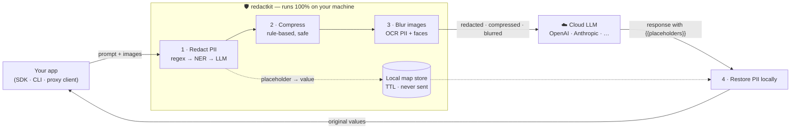
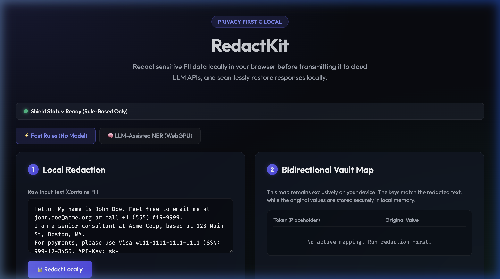
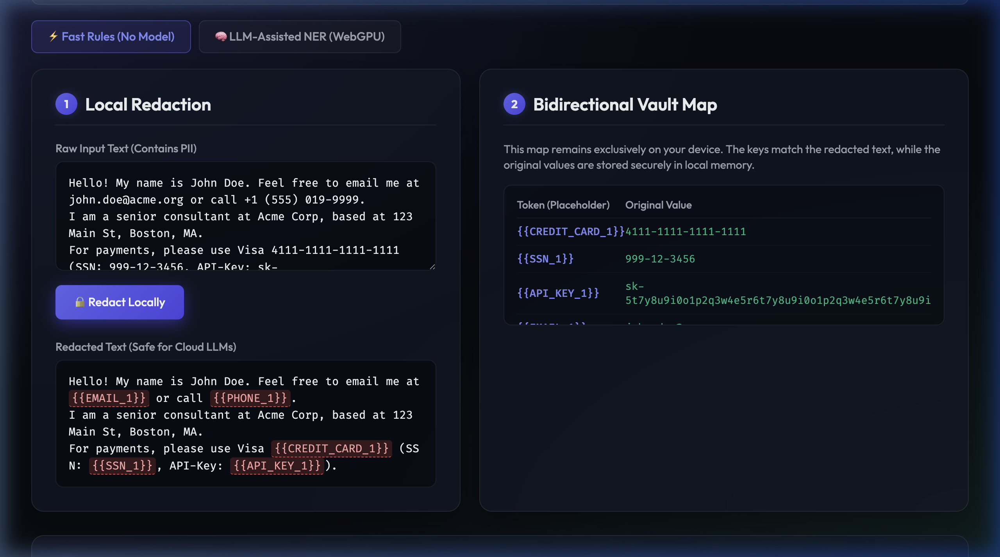
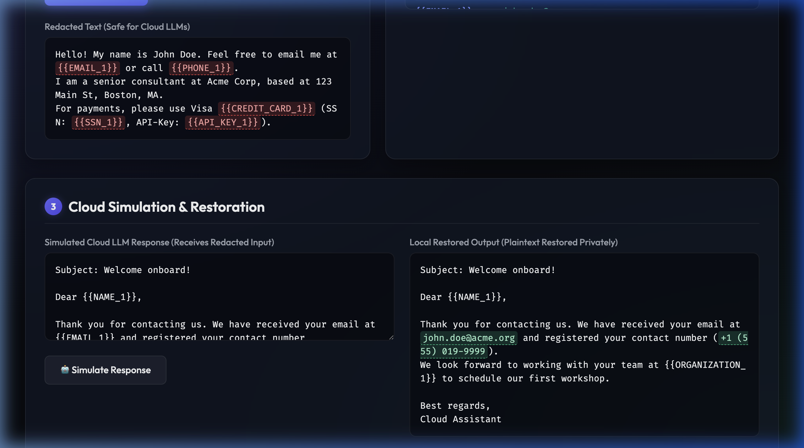
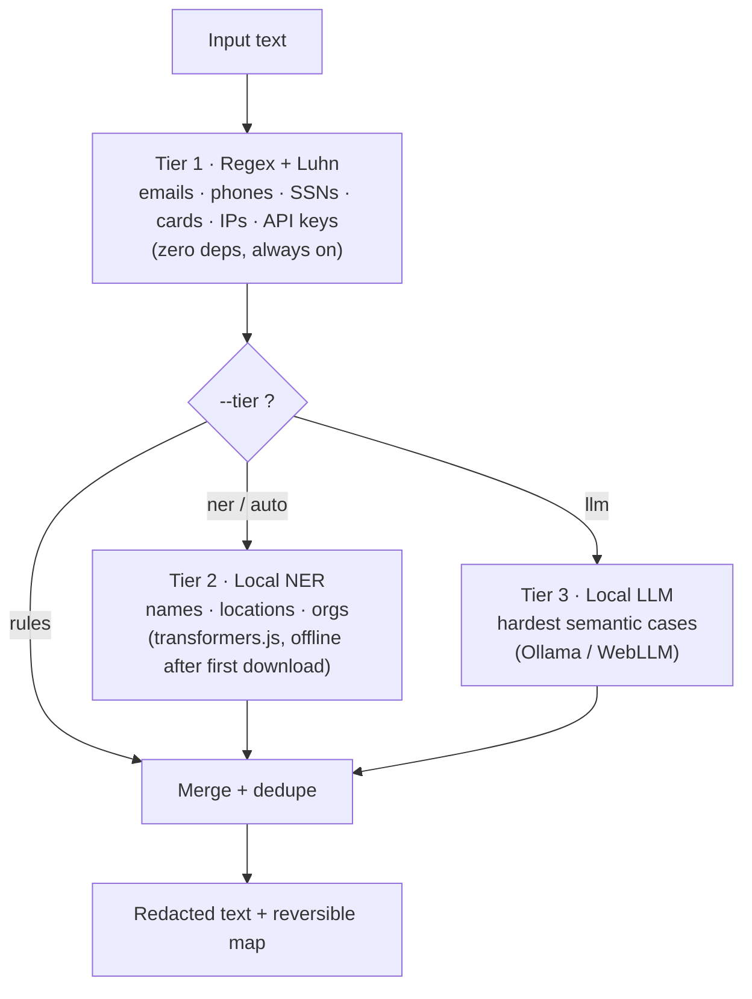
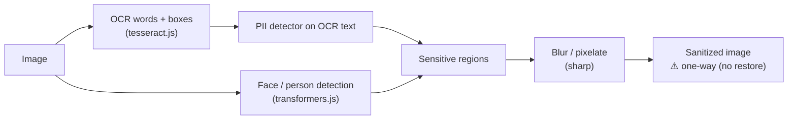

<div align="center">

# RedactKit 🛡️

**A local privacy layer for cloud LLMs** — redact sensitive data before it leaves your machine, restore it in the reply, and optionally compress prompts and blur sensitive data in images. **100% on-device.**

[](https://github.com/pras-ops/redactkit/actions)
[](LICENSE)
[](package.json)
[](ROADMAP.md)
[](CONTRIBUTING.md)

</div>

Use it as a **browser SDK**, a **local proxy/CLI** that shields any app, or a **browser extension**. Because detection, redaction, restoration, compression, OCR, and image blur all run locally, sensitive data **never leaves the device** — helping with HIPAA / GDPR / SOC2 without giving up cloud LLM quality.

---

## Table of contents

- [Why](#why)
- [How it works](#how-it-works)
- [Demo](#demo)
- [Features](#features)
- [Installation](#installation)
- [Quick start](#quick-start)
- [Use it with coding agents](#use-it-with-coding-agents)
- [Detection tiers](#detection-tiers)
- [Compression](#compression)
- [Image sanitization](#image-sanitization)
- [Browser extension](#browser-extension)
- [API reference](#api-reference)
- [Project structure](#project-structure)
- [Development](#development)
- [Privacy and security](#privacy-and-security)
- [Performance](#performance)
- [Roadmap](#roadmap)
- [Contributing](#contributing)
- [License](#license)

---

## Why

Sending prompts to a cloud LLM means sending whatever is in them — names, emails, SSNs, API keys, customer data. RedactKit sits between your app and the provider and strips the sensitive parts **locally**, so the provider only ever sees placeholders like `{{EMAIL_1}}` and blurred images, while your reply still comes back with the real values filled in on your machine.

---

## How it works



The provider only sees placeholders and blurred images. The placeholder → value map stays in a local, TTL-bound store and is used only to restore the reply on your machine. **Text redaction is reversible; image blur is one-way by design.**

---

## Demo

Here is a recording of RedactKit in action, demonstrating the local redaction, simulated cloud LLM response, and automatic local restoration:


For a step-by-step visual breakdown, see below:

<details>
<summary>📸 Step-by-Step Screenshots</summary>

### 1. Ready state (Local Demo Page)
The user enters a prompt containing sensitive PII (name, email, credit card, etc.).


### 2. Local Redaction
RedactKit scans and redacts the PII locally on the machine, replacing it with secure, stable placeholders.


### 3. Response & Local Restoration
The cloud LLM processes the redacted prompt and returns a response containing the placeholders. RedactKit intercepts the response and restores the original PII locally.


</details>

---

## Features

- 🔒 **Reversible redaction** — PII becomes stable placeholders, restored locally; identity preserved across a conversation.
- ⚡ **Tiered, local detection** — `regex → NER → LLM`; the default tier is instant and dependency-free.
- 🔌 **Drop-in for any app** — a local OpenAI/Anthropic/Responses/Gemini-aware **reverse proxy**, plus a browser `fetch` wrapper. Streaming (SSE) responses restored on the fly.
- 🤖 **Shields coding agents** — Claude Code, Codex CLI, and OpenAI-compatible IDEs (see [below](#use-it-with-coding-agents)).
- 🗜️ **Safe compression** — rule-based token reduction (JSON minify, HTML strip, whitespace/dedupe), no AI, no meaning loss.
- 🖼️ **Image sanitization** — blur PII text (OCR) and faces before images reach a vision model.
- 🧩 **Browser extension** — Tier-1 redaction for web chat apps that have no endpoint setting.
- 🕵️ **Private by construction** — nothing written to disk or sent upstream except placeholders and blurred pixels.

---

## Installation

```bash
npm install redactkit
```

Optional add-ons (only for the tiers/features that use them):

```bash
npm i @huggingface/transformers   # Tier 2 local NER + face detection
npm i sharp tesseract.js          # image blur (sharp) + OCR (tesseract.js)
# Ollama (separate install) for the LLM tier — https://ollama.com
```

**Node 18+** is required for the proxy/CLI (uses the built-in `fetch`).

---

## Quick start

### Browser SDK

```javascript
import { Preprocessor } from "redactkit";

const p = new Preprocessor();
const { redacted, map } = await p.redact("Email john.doe@acme.org, card 4111-1111-1111-1111.");
// redacted: "Email {{EMAIL_1}}, card {{CREDIT_CARD_1}}."

// ...send `redacted` to any cloud LLM, then restore its reply locally:
p.restore("We emailed {{EMAIL_1}}.", map); // "We emailed john.doe@acme.org."
```

One-line auto-shielding of `fetch` (redacts prompts, restores streamed replies):

```javascript
import { Preprocessor, createShieldedFetch } from "redactkit";
globalThis.fetch = createShieldedFetch(new Preprocessor());
```

### Local proxy (shield any app, no code change)

```bash
# Tier 1 — rules only, fully local, zero deps (DEFAULT)
npx redactkit serve --port 8787 --upstream https://api.openai.com
export OPENAI_BASE_URL=http://localhost:8787/v1   # point your client here
```

Add capabilities as needed:

```bash
npx redactkit serve --tier ner --compress        # local NER + token compression
npx redactkit serve --blur-images --faces        # sanitize images in vision requests
```

### CLI (one-shot files)

```bash
redactkit redact notes.txt --out safe.txt --map map.json   # + --tier ner
redactkit restore reply.txt --map map.json
redactkit compress payload.json --type json --drop-empty
redactkit blur id-card.png --text-pii --faces --out safe.png
```

---

## Use it with coding agents

Most coding tools let you point at a custom endpoint, so the proxy can shield them. The proxy auto-detects the request format; restrict it with `--format` if you like.

| Tool | Shieldable? | How |
|------|-------------|-----|
| **Claude Code** (CLI) | ✅ works today | `ANTHROPIC_BASE_URL` → proxy (upstream `https://api.anthropic.com`) |
| **Codex CLI** (OpenAI) | ✅ | `OPENAI_BASE_URL` / `~/.codex/config.toml` (Responses API supported) |
| **Cursor / IDEs w/ custom endpoint** | ✅ | set the OpenAI-compatible base URL to the proxy |
| **Google Antigravity** | ⚠️ partial | only its "OpenAI-compatible model" slot; built-in agent can't be redirected |
| **Claude/ChatGPT desktop apps** | ❌ | no base-URL hook → use the [browser extension](#browser-extension) or redact-before-paste |

```bash
# Claude Code — redacts everything it sends to Anthropic, locally
redactkit serve --upstream https://api.anthropic.com --tier ner --compress --format anthropic
export ANTHROPIC_BASE_URL=http://localhost:8787 && claude
```

Supported `--format` values (default = all): `openai`, `anthropic`, `responses`, `gemini`.

---

## Detection tiers

You only pay for what your hardware can run. **Tier 1 (regex) is the default and needs zero dependencies**; richer tiers are opt-in and **add to** Tier 1 rather than replacing it.



| Tier | Engine | Dependency | Detects |
|------|--------|------------|---------|
| `rules` *(default)* | regex + Luhn | **none** | emails, phones, SSNs, cards, IPs, API keys |
| `ner` | local NER ([transformers.js](https://huggingface.co/docs/transformers.js); `Xenova/bert-base-NER` default) | `@huggingface/transformers` *(optional, cached then offline)* | names, locations, organizations |
| `auto` | regex + NER if available | optional | best available, **degrades gracefully** |
| `llm` | local LLM ([Ollama](https://ollama.com) / WebLLM) | Ollama / WebGPU | hardest semantic cases |

---

## Compression

Rule-based and **safe** — reduces tokens without changing meaning, content-type aware: **JSON** minify (`--drop-empty` prunes empties), **HTML** strip + entity decode, **text** whitespace collapse + adjacent-line dedupe. Use it standalone (`redactkit compress`), in the proxy (`--compress`, applied **after** redaction), or as a `compress` step in `pipeline()`.

---

## Image sanitization



Two local region detectors feed one blur pass: **OCR text-PII** (Tesseract.js → tiered detector) and **faces** (transformers.js). `sharp` and `tesseract.js` are optional deps. In the proxy, `--blur-images` sanitizes base64 images inside OpenAI/Anthropic vision requests before forwarding.

> ⚠️ Image blur is **destructive** — the original pixels are gone. There is no image `restore`.

---

## Browser extension

For **web** chat apps (claude.ai, chatgpt.com, gemini) — which have no endpoint setting — an optional Manifest V3 extension in [`extension/`](extension/) redacts locally in the browser by patching `fetch` (MAIN-world). Tier-1 only, experimental (these apps use private request shapes). Load it unpacked — see [extension/README.md](extension/README.md).

---

## API reference

Full reference in [docs/API.md](docs/API.md). Summary:

**Browser SDK — `new Preprocessor(options)`:** `redact`, `restore`, `clean`, `extract`, `chunk`, `prompt`, `pipeline`, `process`, `loadModel`, `checkWebGPU`. `redact` options: `tier`, `rules`, `llm`, `customPatterns`, `allowList`, `denyList`, `formatPreserving`, `state`.

**Node — `redactkit/node`:** `redact`, `restore`, `compress`, `clean`, `chunk`, `extract`, `createProxyServer`, `startProxy`, `ALL_FORMATS`, `MapStore`, `OllamaEngine`, `RegexDetector`, `NERDetector`, `LLMDetector`, `DetectorRouter`, `buildRouter`, `mergeSpans`, `ImageSanitizer`, `OcrPiiRegionDetector`, `FaceRegionDetector`, `blurRegions`, `recompress`.

**CLI — `redactkit <command>`:**

| Command | Purpose | Key flags |
|---------|---------|-----------|
| `serve` | Local reverse proxy | `--port` `--upstream` `--tier` `--format` `--compress` `--blur-images` `--faces` `--ttl` |
| `redact` | Redact a file | `--out` `--map` `--tier` `--format-preserving` |
| `restore` | Restore from a map | `--map` `--out` |
| `clean` | Rule-based cleaning | `--html` `--urls` `--ws` `--linebreaks` `--special` `--entities` |
| `compress` | Token compression | `--type json\|html\|text` `--drop-empty` |
| `blur` | Sanitize an image | `--text-pii` `--faces` `--pixelate` `--ocr-lang` `--tier` |

Run `redactkit help` for the full flag list.

---

## Project structure

```
src/
  index.js              # browser SDK entry (Preprocessor, createShieldedFetch)
  node.js               # Node entry: redactkit/node
  engine.js             # WebLLM engine (browser, lazy)        engines/ollama.js (Node LLM tier)
  detect/               # tiered detection: regex · ner · llm · router
  preprocess/           # redact/restore, clean, clean-rules, chunk, extract
  compress/             # rule-based compression
  image/                # sanitizer · ocr-region-detector · face-region-detector · blur
  server/               # proxy.js (reverse proxy) · store.js (TTL map store)
bin/redactkit.js        # CLI: serve · redact · restore · clean · compress · blur
extension/              # optional MV3 browser extension
docs/                   # API, ARCHITECTURE, BENCHMARKS, TESTING_GUIDE, …
examples/               # basic-demo.html
```

See [docs/ARCHITECTURE.md](docs/ARCHITECTURE.md) for the design.

---

## Development

```bash
git clone https://github.com/pras-ops/redactkit.git
cd redactkit
npm install

npm test           # run the test suite (vitest)
npm run build      # build the browser bundle (tsup -> dist/)
npm run serve      # start the local proxy
npm run dev        # serve examples/basic-demo.html at :8080
```

CI runs the tests and build on Node 18.x and 20.x. See [docs/TESTING_GUIDE.md](docs/TESTING_GUIDE.md).

---

## Privacy and security

- **Local-first:** redaction, NER, OCR, blur, compression, and restore all run on your machine.
- **What the provider sees:** placeholders (`{{TYPE_n}}`) and blurred images — never the originals.
- **The map never leaves:** placeholder→value lives in an in-memory store with a TTL; nothing is persisted or sent upstream.
- **No mandatory downloads:** Tier 1 is pure regex; models (NER/LLM/OCR) are optional and run offline once cached.

> [!WARNING]
> `formatPreserving` keeps structural hints (e.g. an email domain, IP subnet) visible to the provider. Don't enable it if those are themselves sensitive.

To report a vulnerability, see [SECURITY.md](SECURITY.md).

---

## Performance

Rule-based utilities run instantly (no hardware requirements); see [docs/BENCHMARKS.md](docs/BENCHMARKS.md).

| Input size | Clean (HTML+URLs) | Chunk (1000c) | Redact (rules) |
| :--- | :--- | :--- | :--- |
| 10 KB | < 1 ms | < 1 ms | ~1 ms |
| 1 MB | ~4 ms | < 1 ms | ~15 ms |
| 5 MB | ~25 ms | < 1 ms | ~67 ms |

Optional local models add tens of ms (NER) to seconds (LLM); first run downloads + caches, then runs offline.

---

## Roadmap

See [ROADMAP.md](ROADMAP.md) — shipped: tiered detection, multi-provider proxy, compression, image sanitization, browser extension. Next: evaluation harness, compliance profiles, document (PDF/DOCX) redaction.

---

## Contributing

Contributions are welcome! Please read [CONTRIBUTING.md](CONTRIBUTING.md) and the [Code of Conduct](CODE_OF_CONDUCT.md). Use the issue templates for [bugs](.github/ISSUE_TEMPLATE/bug_report.md) and [features](.github/ISSUE_TEMPLATE/feature_request.md).

---

## License

[Apache-2.0](LICENSE) © RedactKit contributors.
